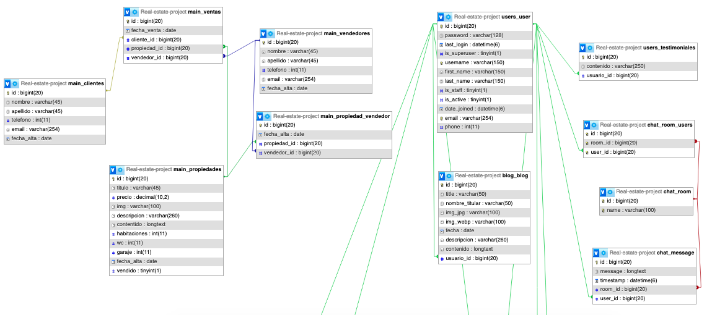

# Documentación del Proyecto

<p align="center">
  
</p>

Puedes encontrar la documentación completa en el siguiente archivo PDF: [Documentación Completa](./static/readme/Documentacion_BienesRaices.pdf)

## Descripción

**Bienes Raíces** es una plataforma web destinada a la venta de propiedades de lujo. El proyecto fue desarrollado como parte de mi Proyecto de Fin de Ciclo (TFC) en el ciclo formativo de Desarrollo de Aplicaciones Web (DAW).

En este proyecto, reflejo mis habilidades tanto en Frontend, Backend, como en la infraestructura y despliegue de la aplicación, así como mi capacidad para adaptarme a nuevas tecnologías.

El proyecto es completamente escalable, lo cual le confiere un gran potencial de crecimiento. Durante su desarrollo, se implementaron varios cambios siguiendo un **ciclo de vida en espiral**. Este proyecto incluye funcionalidades tanto para **usuarios finales** como para **clientes potenciales** y **usuarios administradores**.

Además, también se desarrolló una **API Restful** para gestionar las propiedades usando **Django Rest Framework**, la cual se detalla más adelante.

## Funcionalidades

- **Registro de Usuarios**: A través de la API de Google o mediante un formulario de registro.
- **Administración de Propiedades**: Sistema CRUD para gestionar propiedades (crear, leer, actualizar, eliminar).
- **Sección de Anuncios de las Propiedades**: Se listan todas las propiedades en venta.
- **Formulario de Contacto**: Permite a los usuarios interesados comunicarse directamente con la inmobiliaria.
- **Sección de Reseñas**: Donde el usuario registrado puede dejar una reseña.
- **Sección de Blog**: Publicaciones sobre consejos, mejoras del hogar y noticias del mercado inmobiliario de lujo.
- **Navegación Intuitiva**: Diseño moderno y responsivo, adaptado para diferentes dispositivos.
- **Modo Oscuro (Dark Mode)**: Opción para alternar entre los modos de visualización claro y oscuro.
- **Desarrollo de una API Restful**: Una API para las propiedades usando Django Rest Framework.

## Tecnologías Utilizadas

Este proyecto fue empaquetado en un contenedor **Docker** y previamente desplegado en los **servicios de AWS**, específicamente en **Elastic Beanstalk**. Actualmente, debido a la falta de créditos para este servicio, el proyecto está desplegado en el **servidor de PythonAnywhere**.

<table>
  <tr>
    <th><strong>Frontend</strong></th>
    <th><strong>Backend</strong></th>
    <th><strong>Infraestructura</strong></th>
  </tr>
  <tr align="center">
    <td>
      
      
      
      
      
    </td>
    <td>
      
      
      
    </td>
    <td>
      
      
      
    </td>
  </tr>
</table>

## Arquitectura de la Base de Datos

La base de datos, mostrada en la imagen a continuación, está diseñada para gestionar la información relacionada con el proyecto inmobiliario Bienes Raíces.

La base de datos evolucionó para soportar funcionalidades adicionales conforme el proyecto creció, como la publicación de blogs y reseñas por parte de los usuarios registrados, así como para gestionar un registro de vendedores, compradores y la relación entre ellos.

<p align="center">
  
</p>

## API Restful - Bienes Raíces

Se ha creado una **API Restful** utilizando **Django Rest Framework** para gestionar las propiedades en venta.

Esta API permite realizar operaciones exclusivamente de lectura sobre las propiedades, facilitando la integración con otras aplicaciones web, móviles, de escritorio o servicios que puedan requerir acceso a esta información.

**Uso de la API**:

Te recomiendo visitar el repositorio donde se prueba la **API Restful**. En este repositorio se explican los pasos a seguir, como también el código donde puedes clonar el repositorio.

```bash
  https://github.com/CristianEduardoo/Real-Estate-API-Client
```

Si deseas ver el resultado final del repositorio, probando la API Restful, visita la siguiente URL. Ten en cuenta que el proyecto esta desplegado en un servidor gratuito y puede tardar un poquito, se paciente 😉

```bash
  https://api.cristian-castro.com/
```

No obstante, puedes obtener la información desde cualquier interfaz en la que estés trabajando o con la que te sientas más familiarizado utilizando el siguiente enlace:

```bash
  https://pypycris.pythonanywhere.com/api/v1/propiedades/
```

## Contacto

Cristian Eduardo Castro Vargas  
[Email](cj.94@hotmail.com) | [LinkedIn](https://www.linkedin.com/in/cristian-castro-vargas/) | [Portafolio](https://cristian-castro.com/)
