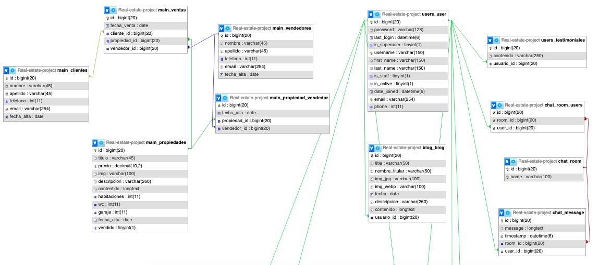

# Documentación del Proyecto

<p align="center">
  
</p>

<!-- Puedes encontrar la documentación completa en el siguiente archivo PDF: [Documentación Completa](./static/readme/Documentacion_BienesRaices.pdf) -->

## Descripción

**Bienes Raíces** es una plataforma web destinada a la venta de propiedades de lujo. El proyecto fue desarrollado como parte de mi Proyecto de Fin de Ciclo (TFC) en el ciclo formativo de Desarrollo de Aplicaciones Web (DAW).

En este proyecto, reflejo mis habilidades tanto en Frontend, Backend, como en la infraestructura y despliegue de la aplicación, así como mi capacidad para adaptarme a nuevas tecnologías.

El proyecto es completamente escalable, lo cual le confiere un gran potencial de crecimiento. Durante su desarrollo, se implementaron varios cambios siguiendo un **ciclo de vida en espiral**. Este proyecto incluye funcionalidades tanto para **usuarios finales** como para **clientes potenciales** y **usuarios administradores**.

Además, también se desarrolló una **API Restful** para gestionar las propiedades usando **Django Rest Framework**, la cual se detalla más adelante.

## Funcionalidades

- **Autenticación y Registro**: Integración con OAuth 2.0 de Google y formulario de registro con validaciones de correo electrónico.
- **Gestión de Propiedades (CRUD)**: Panel administrativo completo para crear, leer, actualizar y eliminar propiedades de lujo.
- **Chat en Tiempo Real**: Sistema de mensajería WebSocket para comunicación instantánea entre usuarios, clientes y administradores.
- **Listado de Propiedades**: Catálogo visual y detalles completos decada inmueble.
- **Sistema de Contacto**: Formulario para consultas de clientes interesados con comunicación directa a la inmobiliaria.
- **Reseñas y Testimoniales**: Módulo donde usuarios registrados pueden dejar valoraciones y comentarios sobre propiedades.
- **Blog Inmobiliario**: Publicaciones sobre consejos, mejoras del hogar y noticias del mercado de propiedades de lujo.
- **Diseño Responsivo**: Interfaz adaptada automáticamente para desktop, tablet y dispositivos móviles.
- **Accesibilidad**: Navegación intuitiva, modo oscuro y diseño centrado en la experiencia del usuario.

## Tecnologías Utilizadas

El proyecto fue empaquetado en contenedores **Docker** para garantizar consistencia entre entornos. Cuenta con despliegue en múltiples plataformas: previamente en **AWS Elastic Beanstalk/EC2, PythonAnywhere, y actualmente en un servidor Linux dedicado.** La API RESTful está documentada y disponible para integración con aplicaciones externas.


<table>
  <tr>
    <th><strong>Frontend</strong></th>
    <th><strong>Backend</strong></th>
    <th><strong>Infraestructura</strong></th>
  </tr>
  <tr align="center">
    <td>
      
      
      
      
      
    </td>
    <td>
      
      
      
      
      
    </td>
    <td>
      
      
      
    </td>
  </tr>
</table>


### Backend con Python & Django:

- Implementación del patrón MVC con soporte ASGI/WSGI para aplicaciones síncronas y asíncronas
- Comunicación en tiempo real mediante Django Channels e integración con Redis para gestionar conexiones WebSocket
- Arquitectura ORM soportando múltiples bases de datos (MySQL, PostgreSQL) con configuración según entorno (desarrollo, Docker, producción)
- API RESTful utilizando Django Rest Framework para operaciones de lectura/escritura en propiedades
- Integración OAuth 2.0 con Google Sign-in para autenticación segura
- Sistema avanzado de gestión de sesiones y control de acceso basado en roles (usuarios finales, clientes, administradores)

### Frontend Responsivo y Moderno:

- HTML5, CSS3 y JavaScript con validaciones avanzadas
- Bootstrap 5 para componentes responsive y accesibles
- SCSS/Sass con automatización mediante Gulp para estilos escalables y mantenibles
- jQuery para manipulación dinámica del DOM y actualizaciones asíncronas
- Modo Oscuro completamente implementado en todas las interfaces

### Infraestructura y DevOps:

- Containerización con Docker para entornos de desarrollo y producción
- Configuración multi-entorno para gestionar diferentes bases de datos y servidores según el contexto
- Historial de despliegue: AWS Elastic Beanstalk, PythonAnywhere, actualmente en servidor Linux dedicado


## Arquitectura de la Base de Datos

La base de datos, mostrada en la imagen a continuación, está diseñada para gestionar la información relacionada con el proyecto inmobiliario Bienes Raíces.

La base de datos evolucionó para soportar funcionalidades adicionales conforme el proyecto creció, como la publicación de blogs y reseñas por parte de los usuarios registrados, así como para gestionar un registro de vendedores, compradores y la relación entre ellos.

<p align="center">
  
</p>

## API Restful - Bienes Raíces

Se ha creado una **API Restful** utilizando **Django Rest Framework** para gestionar las propiedades en venta.

Esta API permite realizar operaciones exclusivamente de lectura sobre las propiedades, facilitando la integración con otras aplicaciones web, móviles, de escritorio o servicios que puedan requerir acceso a esta información.

**Uso de la API**:

Te recomiendo visitar el repositorio donde se prueba la **API Restful**. En este repositorio se explican los pasos a seguir, como también el código donde puedes clonar el repositorio.

```bash
https://github.com/CristianEduardoo/Real-Estate-API-Client
```

Si deseas ver el resultado final del repositorio, probando la API Restful, visita la siguiente URL. Ten en cuenta que el proyecto esta desplegado en un servidor gratuito y puede tardar un poquito, se paciente 😉

```bash
https://api.cristian-castro.com/
```

No obstante, puedes obtener la información desde cualquier interfaz en la que estés trabajando o con la que te sientas más familiarizado utilizando el siguiente enlace:

```bash
https://pypycris.pythonanywhere.com/api/v1/propiedades/
```

## Contacto

Cristian Eduardo Castro Vargas  
[Email](cj.94@hotmail.com) | [LinkedIn](https://www.linkedin.com/in/cristian-castro-vargas/) | [Portafolio](https://cristian-castro.com/)
